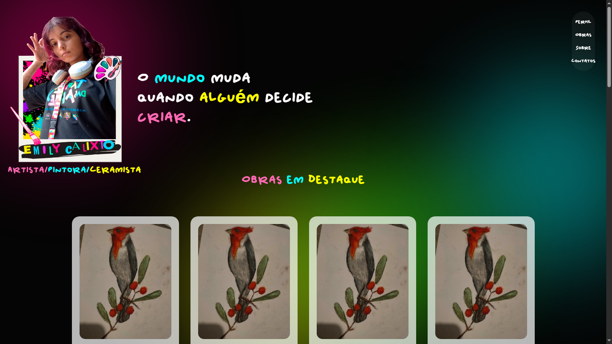
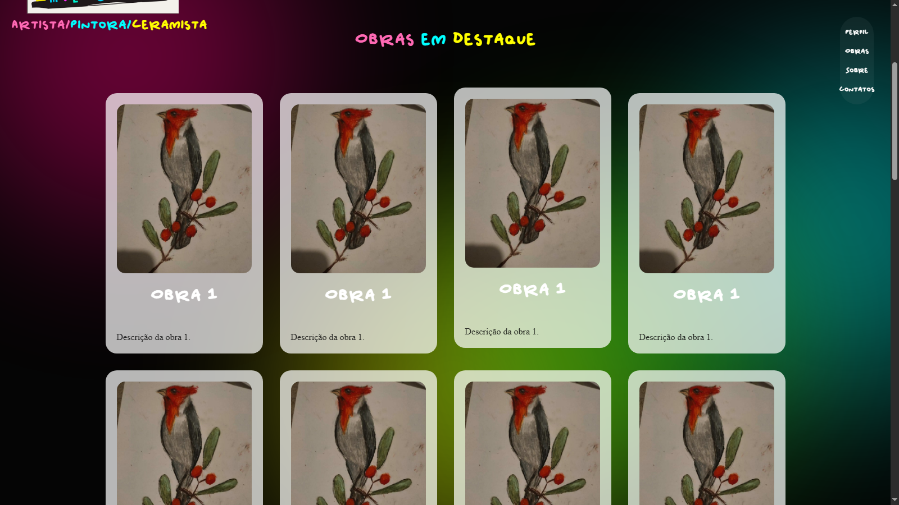
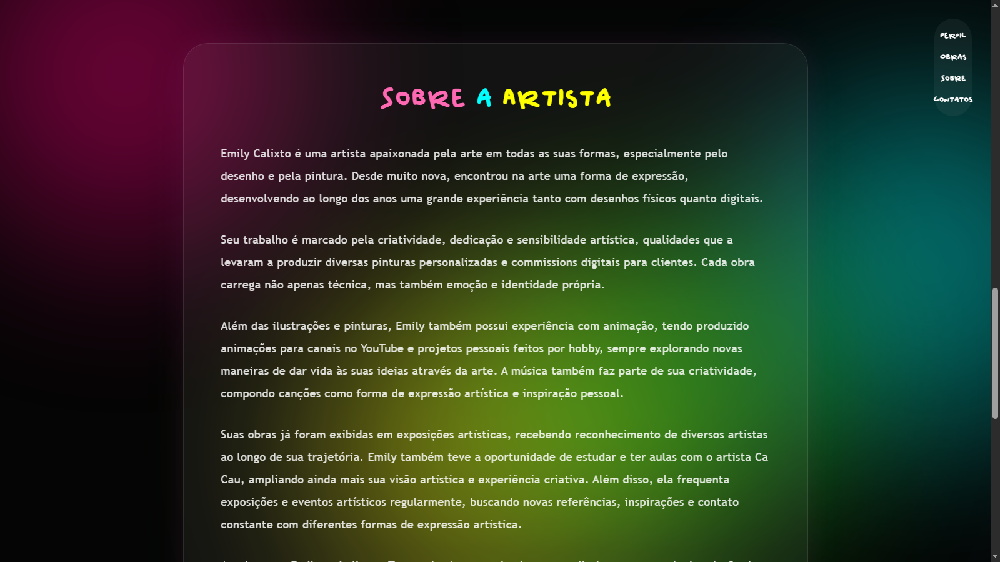
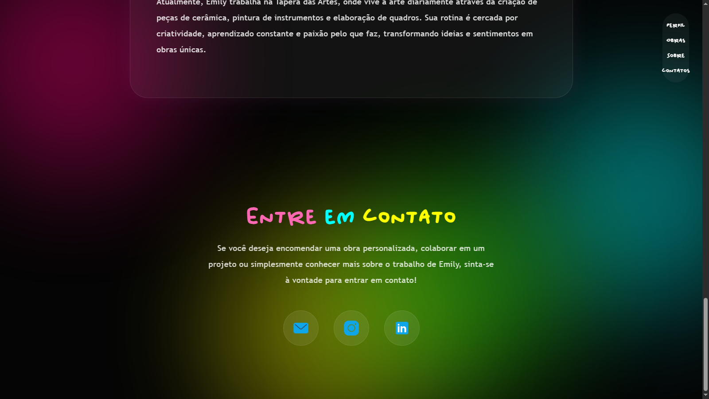

# 🎨 Landing Page Artística - Portfólio Emily Calixto

Este projeto é uma landing page desenvolvida como forma de apresentação artística e portfólio pessoal para a artista **Emily Calixto**.  
O objetivo é unir design criativo, experiência visual e responsividade para destacar obras, trajetória e formas de contato.

---

## ✨ Sobre o projeto

A landing page foi construída com foco em estética artística moderna, utilizando elementos visuais como:

- Gradientes neon e backgrounds dinâmicos
- Efeito de “fumaça colorida” no fundo
- Cards com efeito glassmorphism
- Animações de entrada ao scroll
- Menu flutuante interativo
- Hover effects suaves e modernos

---

## 🖼️ Seções do site

### 🏠 Hero Section
Apresentação inicial com imagem, nome e destaque artístico, utilizando tipografia estilizada e composição visual impactante.

📸 **Print da Hero Section:**  

---

### 🎨 Obras em Destaque
Galeria de trabalhos artísticos organizados em cards com hover animado.

📸 **Print da Galeria:**  

---

### 🧑 Sobre a Artista
Seção descritiva contando a trajetória artística de Emily Calixto, suas experiências com:
- Desenho tradicional e digital
- Animação
- Comissões artísticas
- Música como hobby
- Exposições e eventos artísticos

📸 **Print da seção Sobre:**  

---

### 📩 Contato
Área de contato com links para:
- E-mail
- Instagram
- LinkedIn

Com botões interativos e efeitos de hover com glow neon.

📸 **Print da seção Contato:**  

---

## 🎨 Tecnologias utilizadas

- HTML5 semântico
- CSS3 avançado (Flexbox, Gradients, Glassmorphism)
- JavaScript puro (Intersection Observer API)
- Animações CSS (keyframes + transitions)
- Design responsivo (media queries)

---

## 🚀 Funcionalidades

- ✔ Animações ao scroll (efeito pop)
- ✔ Menu flutuante interativo
- ✔ Layout totalmente responsivo
- ✔ Efeitos visuais modernos (neon + blur + glow)
- ✔ Hover animations suaves
- ✔ Fundo dinâmico com “fumaça colorida”

---

## 💡 Objetivo

Projeto criado para prática e portfólio freelance com foco em:
- Apresentação artística profissional
- Experiência de usuário fluida
- Design moderno e criativo
- Demonstração de habilidades em front-end

---

## 📌 Melhorias futuras

- [ ] Otimização de performance
- [ ] Alterar foto de perfil (porque minha namorada disse que a atual está feia 😅)

---

## 👩‍🎨 Autoria

Desenvolvido por **Richard R. Araújo** como projeto de portfólio freelance.

Menção honrosa: **Emily Calixto — minha namorada e artista responsável pela inspiração deste projeto**, cuja identidade criativa e trabalho artístico deram vida a toda a ideia da landing page.

---
